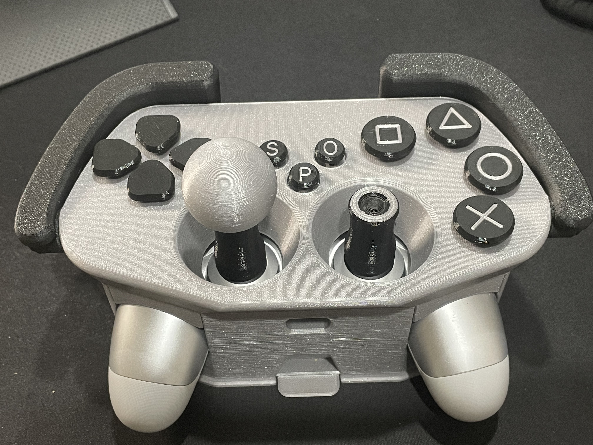

# Visual Doorbell
This device aims to assist those in the Deaf and Hard of Hearing Community by giving them a visual notification that someone is at the door. When a delivery person or visitor presses the doorbell, the lamp inside will flash. The lamp also functions as a normal desk lamp, with a slider to control the brightness and turn the lamp off, as well as a rotary knob to change the color of the light.

Visual Doorbell Images:

Doorbell

Lamp

## More info at
- [Makers Making Change Project Page](https://makersmakingchange.com/project/adaptive-case-for-ps4-controller)
- [Makers Making Change Forum Thread](https://makersmakingchange.com/forum/topic/adaptive-case-for-ps4-controller/)

## How to Obtain a Visual Doorbell
### 1. Do it Yourself (DIY) or Do it Together (DIT)

This is an open-source assistive technology, so anyone is free to build it. All of the files and instructions required to build the Visual Doorbell are contained within this repository. Refer to the Maker Checklist below.

### 2. Request a build of this device

If you would like to obtain a Visual Doorbell, you may submit a build request on the [MMC Website](https://www.makersmakingchange.com/). The requestor is responsible for the cost of materials and any shipping.

### 3. How to build this device for someone else

If you have the skills and equipment to build this device, and would like to donate your time to create the Visual Doorbell for someone who needs it, visit the [MMC Maker Wanted](https://makersmakingchange.com/maker-wanted/) section.

## Getting Started

### 1. Read the Makers Checklist

The Makers Checklist contains a list of tasks to complete to build the device.

### 2. Print the 3D Printable components

All of the 3D print files can be found in the [3D Print Files](https://github.com/MustardTek/visual-doorbell-jacdac/tree/main/3D%20Print%20Files) folder

### 3. Assemble the Visual Doorbell

Reference the (assembly guide) for the tools and steps required to build each portion. 

## Files
### Documentation
| Document             | Version | Link |
|----------------------|---------|------|
| Design Rationale     | 1.0     | [Adaptive_Case_for_Ps4_Controller_Design_Rationale](/Documentation/Adaptive_Case_for_Ps4_Controller_Design_Rationale.pdf)     |
| Maker Checklist      | 1.0     | [Adaptive_Case_for_Ps4_Controller_Maker_Checklist](/Documentation/Adaptive_Case_for_Ps4_Controller_Maker_Checklist.pdf)     |
| Bill of Materials    | 1.0     | [Visual Doorbell BOM](https://github.com/MustardTek/visual-doorbell-jacdac/blob/main/Documentation/Visual%20Doorbell%20BOM%2001.xlsx)|
| 3D Printing Guide    | 1.0     | [Adaptive_Case_for_Ps4_Controller_3D_Printing_Guide](/Documentation/Adaptive_Case_for_Ps4_Controller_3D_Printing_Guide.pdf)   |
| Assembly Guide       | 1.0     | [Adaptive_Case_for_Ps4_Controller_Assembly_Guide](/Documentation/Adaptive_Case_for_Ps4_Controller_Assembly_Guide.pdf)     |
| User Guide           | 1.0     | [Adaptive_Case_for_Ps4_Controller_User_Guide](/Documentation/Adaptive_Case_for_Ps4_Controller_User_Guide.pdf)    |

### Code Files
Links to the MakeCode can be found in the Assembly Guide. You can also find the code files [here](https://github.com/MustardTek/visual-doorbell-jacdac/tree/main/Code%20Files). 

## Attribution

Design by MustardTek. MustardTek is a .... 
 - Website:[www.MustardTek.com](https://mustardtek.com/)
 -
 - []

Documentation by MustardTek and Angela Guo. 

## License
Everything needed or used to design, make, test, or prepare the Visual Doorbell is licensed under the CERN 2.0 Permissive license <https://ohwr.org/project/cernohl/wikis/Documents/CERN-OHL-version-2> (CERN-OHL-P) . 

Accompanying material such as instruction manuals, videos, and other copyrightable works that are useful but not necessary to design, make, test, or prepare the Adaptive_Case_for_Ps4_Controller are published under a Creative Commons Attribution-ShareAlike 4.0 license https://creativecommons.org/licenses/by-sa/4.0/ (CC BY-SA 4.0).

---

## About Makers Making Change

Makers Making Change is an initiative of [Neil Squire](https://www.neilsquire.ca/), a Canadian non-profit that empowers people with disabilities.

We are committed to creating a network of volunteer makers who support people with disabilities in their communities through 3D printing assistive devices. Check out our library of free, open-source assistive technologies with parts and build instructions.

 - Website: [www.MakersMakingChange.com](https://www.makersmakingchange.com/)
 - GitHub: [https://github.com/makersmakingchange](https://github.com/makersmakingchange)
 - Twitter: [@makermakechange](https://twitter.com/makermakechange)
 - Instagram: [@makersmakingchange](https://www.instagram.com/makersmakingchange)

## Contact Us

For technical questions, to get involved, or share your experience we encourage you to visit the [MMC Website](https://www.makersmakingchange.com/), [MMC Forum](https://makersmakingchange.com/forum), or contact info@makersmakingchange.com
